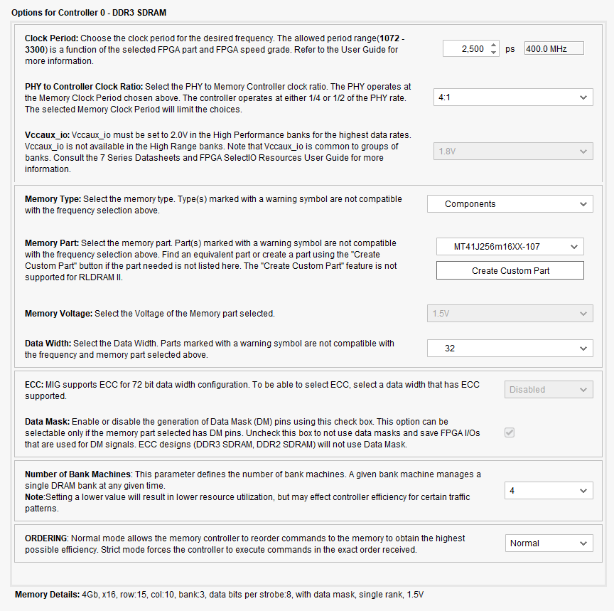

# Microblaze V on Genesys 2
This readme explains the steps followed to create a Microblaze V soft CPU on the Genesys 2 board sporting a Kintex 7 FPGA from AMD Xilinx.

## Creating the project
The project has been created using the board xml file from Digilent corresponding to Genesys 2 and the XDC constraints files that can be found in Digilent repository on Github: [https://github.com/Digilent/digilent-xdc/blob/master/Genesys-2-Master.xdc](https://github.com/Digilent/digilent-xdc/blob/master/Genesys-2-Master.xdc). The constraints have to be manually added to the Constraints set of the project

## Block diagram project

IP integrator is used as a way to provide an easy manner for instantiating IPs in a graphical fashion. [https://docs.amd.com/r/en-US/ug994-vivado-ip-subsystems/Getting-Started-with-Vivado-IP-Integrator](https://docs.amd.com/r/en-US/ug994-vivado-ip-subsystems/Getting-Started-with-Vivado-IP-Integrator)

The following things have been instantiated in the block diagram design:

- Microblaze V CPU
- MIG (Memory Interface Generator) for 1GB DDR3 RAM
- AXI Interrupt Controller
- Microblaze Local Memory
- Microblaze Debug Module V
- Processor System Reset
- AXI UART Lite
- AXI GPIO: The switches and buttons are concatenated using Concat block and connected to GPIO channel 1. The LEDs are connected to GPIO channel 2.
- AXI Interconnect for connecting the peripherals labelled as AXI with the Microblaze CPU

Remember to generate the block design afterwards using the *Generate Block Design* button in Flow Navigator.
## Configuration of the different elements

The elements in the block diagram are configured with double click as follows:
- Microblaze V, click on Advanced:
    - Disable all instruction, data cache and disecrete ports.
    - Enable Missaligned Exceptions and Illegal Instructions Exceptions in BASIC Mode at a minimum.
    - Make sure that in Debug tab, the Debug Module Interface is enabled
    - In Buses, enable both Local Memory Bus Interfaces (Data and Instruction) and both AXI Interfaces (Data and Instruction)
- Local memory: Use the Block automation from Vivado to get the correct core
- MIG 7 series: follow the images shown below. For the pages that no corresponding image is found, just leave it in the default settings.

- AXI UART Lite:
    - Baud Rate: 115200
    - Bits: 8
    - Stop bits:1
    - Parity: None

- AXI GPIO 0:
    - Use Dual Channel: ON
    - Channel 1: Tick "All Inputs". Width 8 bits
    - Channel 2: Tick "All Outputs". Width 8 bits

- AXI GPIO 1:
    - Use Dual Channel: OFF
    - Channel 1: Tick "All Inputs". Width 5 bits

- AXI Interconnect:
    - Number of Slave Interfaces: 2
    - Number of Master Interfaces: 3

- AXI Interrupt Controller
    - Use Fast Logic: OFF
    - Leave all the options in Auto

Also, go in Vivado to Window > Address Editor and ensure that you have exactly what is displayed in the below image:

If there is some Unassigned memory spaces just right click on them and click *Assign*.

## Pin configuration
The following inputs and outputs are currently present in the design:

- sys_diff_clock: Pins AD11 and AD12, present in the XDC file, uncomment them in the file and be very careful with the pin name
- reset: R19 pin. Low level reset asserted by a push button in the Genesys 2 board.
- ddr3_sdram: this ping assignment is automatic after configuring and validating MIG 7 IP.
- usb_uart: uart_txd is pin Y23 and uart_rxd is pin Y20. They go to the microUSB labelled as UART in the Genesys 2 PCB.

# Aspects to take into account
- The maximum clock speed that the Microblaze V can use is near 100 MHz. 200 MHz makes some things not working, like the data and instruction cache or some peripherals like the UART Lite, which has a max clock frequency in its datasheet of 200MHz for Kintex 7 -2 speed grade. This is borderline best case scenario
- When processing interruptions from the AXI interruption controller, it seems there is a missaligned access in memory (the software is trying to read a memory position without using a Store Word instruction, more like a byte access). This means that Missaligned Exceptions need to be enabled in the Microblaze V.
- For debugging, use -O0 and -g3 options un UserConfig.cmake
- AssertVoid() functions in Interruption GPIO driver don't seem to work, they just hang the CPU. Maybe they no longer do with Missalignment exceptions. 
- The functions within the drivers are built together with the platform project, not the application project. So, to modify the flags there, you need to use the Makefiles in the corresponding folders of the libraries, the Cmake in the application folder will not work.